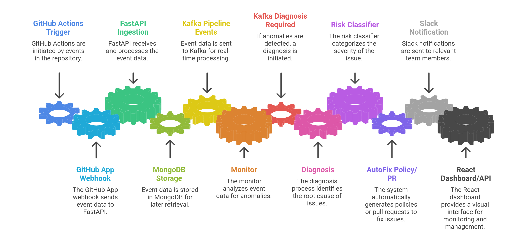
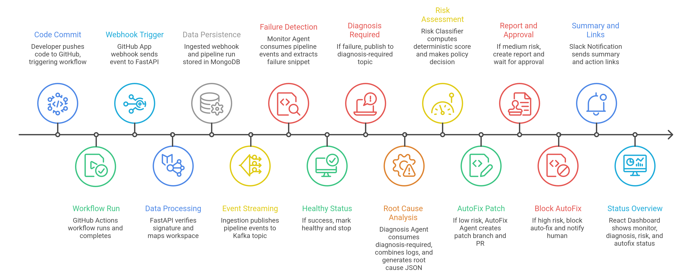

# PipelineIQ

PipelineIQ is an AI-powered CI/CD failure intelligence and auto-remediation platform.

It listens to GitHub Actions workflow completion events, detects failures, diagnoses likely causes, scores risk, and decides whether to auto-fix, request approval, or only report.

## What Lives Where

- `pipelineIQ/`: Main backend (FastAPI, MongoDB, Kafka consumer/producer runtime, risk + autofix agents)
- `pipelineIQ-frontend/`: Main frontend dashboard (React + Vite + Tailwind)
- `flask_app/`: Simple demo service used for local failure simulation/testing
- `docs/`: Setup guides (Kafka, Slack, deployment, simulation)

## Core Problem

CI/CD failures are expensive because teams must manually inspect long logs, map error context to recent code changes, and decide if an automated patch is safe.

PipelineIQ reduces this latency by converting raw workflow failure events into structured actions.

## End-to-End Flow

1. A GitHub Actions workflow completes.
2. GitHub App webhook hits `/api/github/webhooks`.
3. Backend validates webhook signature and maps installation -> workspace.
4. A normalized pipeline event is created and pushed to Kafka topic `pipeline-events` (or handled inline if Kafka is disabled).
5. Monitor stage extracts failing log snippet and marks pipeline run health.
6. Failing runs are queued to `diagnosis-required` topic.
7. Diagnosis stage combines error snippet + GitHub compare diff to produce likely root cause.
8. Risk classifier computes deterministic score from branch/environment, diff size, file types, review/history signals, and blast radius.
9. Policy engine selects one action using workspace thresholds:
   - Auto-fix below threshold
   - Require approval in mid band
   - Block/report only in high risk
10. Auto-fix agent proposes minimal patch (up to 3 files), creates branch/PR, optionally requests reviewers, and may auto-merge if allowed.
11. Slack notifications and frontend report/feedback links are generated.
12. Resolution feedback is stored for future memory-aware auto-fix decisions.

## Architecture Snapshot



## Business Logic and Decisions

### 1) Failure Detection (Monitor)

- Uses workflow conclusion first (`SUCCESS`/`FAILURE`), with log keyword fallback (`error`, `failed`, `traceback`, etc.).
- Builds concise error snippets for downstream diagnosis.

### 2) Diagnosis

- Pulls workflow logs from GitHub Actions run artifacts.
- Pulls compare diff between base and head commit.
- Produces compact JSON diagnosis with:
  - `error_type`
  - `possible_causes`
  - `latest_working_change`

### 3) Deterministic Risk Scoring

Risk score is derived from weighted signals such as:

- Target environment inferred from branch (dev/staging/pre-prod/production)
- Diff size and changed file categories (auth, migrations, infra, secrets, business logic)
- API surface touched (static/frontend/internal/public/queue schema)
- Commit/review signals (reviewers, hotfix/WIP, off-hours, first-time deployer)
- Historical failure trend and potential blast radius

Workspace owners define decision thresholds via risk profile:

- `auto_fix_below` (default 30)
- `require_approval_above` (default 60)

### 4) Auto-Fix Policy

- Low risk: attempt automatic remediation and create PR flow (optionally merge based on policy/memory feedback).
- Medium risk: create report and wait for approval.
- High risk: block auto-fix, notify, and request manual intervention.

### 5) Feedback Loop

- Report decision feedback and post-resolution quality feedback are captured.
- Similar successful patterns can influence future automation confidence.

## Tech Stack

### Frontend (`pipelineIQ-frontend`)

- React 19
- Vite 8
- Tailwind CSS v4
- React Router DOM v7
- Axios

### Backend (`pipelineIQ`)

- FastAPI + Uvicorn
- Beanie ODM + Motor (MongoDB)
- aiokafka (event runtime)
- python-jose (JWT/session and signed tokens)
- httpx (GitHub + Slack + external HTTP)
- OpenAI-compatible SDK client for model providers

### Demo Service (`flask_app`)

- Flask 2.3 (small local app for health/user/order routes and failure simulation support)

### Infrastructure

- MongoDB Atlas (or local MongoDB)
- Apache Kafka (optional, can be disabled with `KAFKA_ENABLED=false`)
- GitHub App + GitHub OAuth App
- Slack Incoming Webhook (optional)
- LLM providers supported via gateway:
  - GitHub Models
  - Groq
  - OpenAI-compatible endpoint

## External Integrations

1. GitHub OAuth: user login to dashboard.
2. GitHub App: repository installation, webhook delivery, workflow logs, compare diff, PR and branch operations.
3. LLM providers: monitor/diagnosis/risk/autofix agent reasoning with provider fallback.
4. Slack webhook: alerting and action links.
5. MongoDB: persistent source of truth for workspace, events, runs, execution, memory/feedback.
6. Kafka: asynchronous stage decoupling for monitor and diagnosis workloads.

## Data Model Highlights

- `Workspace`: repository connection + risk profile + ownership + Slack mention config.
- `PipelineRun`: monitor/diagnosis/risk/autofix status and reports per workflow run.
- `WebhookEvent`: raw GitHub webhook event record for audit/debug.
- `AutoFixExecution`: generated fix attempt, PR data, and status.
- `AutoFixFeedback`: human feedback on automation quality and outcomes.
- `AutoFixMemory`: learned signals for repeated failure signatures.

## Local Setup (Recommended)

### 1) Clone and Configure

```bash
git clone https://github.com/your-username/hacktofuture4-D02.git
cd hacktofuture4-D02
cp .env.example .env
```

Fill values in `.env` for GitHub OAuth, GitHub App, MongoDB, and at least one LLM provider.

### 2) Optional Kafka (for full event-driven flow)

If you want Kafka enabled (`KAFKA_ENABLED=true`), run broker and topics:

```bash
docker run -d --name pipelineiq-kafka \
  -p 9092:9092 \
  -e KAFKA_NODE_ID=1 \
  -e KAFKA_PROCESS_ROLES=broker,controller \
  -e KAFKA_LISTENERS=PLAINTEXT://:9092,CONTROLLER://:9093 \
  -e KAFKA_ADVERTISED_LISTENERS=PLAINTEXT://localhost:9092 \
  -e KAFKA_CONTROLLER_LISTENER_NAMES=CONTROLLER \
  -e KAFKA_LISTENER_SECURITY_PROTOCOL_MAP=CONTROLLER:PLAINTEXT,PLAINTEXT:PLAINTEXT \
  -e KAFKA_CONTROLLER_QUORUM_VOTERS=1@localhost:9093 \
  apache/kafka:3.9.0

docker exec -it pipelineiq-kafka /opt/kafka/bin/kafka-topics.sh \
  --create --topic pipeline-events --bootstrap-server localhost:9092 --partitions 3 --replication-factor 1

docker exec -it pipelineiq-kafka /opt/kafka/bin/kafka-topics.sh \
  --create --topic diagnosis-required --bootstrap-server localhost:9092 --partitions 3 --replication-factor 1
```

If you want simpler startup, keep `KAFKA_ENABLED=false` in `.env` and the backend will process in-process.

### 3) Run Backend

```bash
cd pipelineIQ
python3 -m venv .venv
source .venv/bin/activate
pip install -r requirements.txt
uvicorn main:app --reload
```

Backend: `http://localhost:8000`

### 4) Run Frontend

```bash
cd pipelineIQ-frontend
npm install
npm run dev
```

Frontend: `http://localhost:5173`

Vite proxies `/api` to backend on `http://localhost:8000`.

### 5) Run Flask Demo App (Optional)

```bash
cd flask_app
python3 -m venv .venv
source .venv/bin/activate
pip install -r requirements.txt
python app.py
```

Flask demo app: `http://localhost:5000`

## API Entry Points

- Auth: `/api/auth/*`
- Workspaces: `/api/workspaces/*`
- GitHub install + webhook: `/api/github/installations/callback`, `/api/github/webhooks`
- Autofix report and feedback: `/api/autofix/report`, `/api/autofix/feedback`
- Health: `/health`

## Workflow



## Notes

- The root `Dockerfile` builds and runs the Flask demo app, not the FastAPI backend.
- For production, secure cookie settings (`COOKIE_SECURE=true`) and proper domain configuration are required.
- Use the docs in `docs/` for Kafka, Slack, deployment, and failure simulation walkthroughs.
