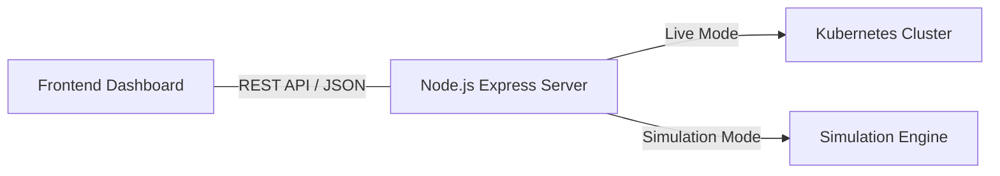

# 🌌 Agentic K8s Control Center

Welcome to the future of autonomous infrastructure. This hackathon project demonstrates a **Self-Healing Neural Network** that proactively monitors, predicts, and resolves Kubernetes cluster degradation.

## 🚀 Features
- **AI Prediction Engine**: Predicts pod saturation before it happens by analyzing traffic velocity metrics.
- **Autonomous Healing**: Intercepts critical loads and dynamically injects `HPA` overrides or provisions replica sets to restore cluster health.
- **Dual-Engine Backend**: 
  - *Simulation Mode*: Runs entirely locally with dynamic generative scenarios if no active cluster is present (perfect for offline presentations).
  - *Live Mode*: Connects via `@kubernetes/client-node` and executes real `kubectl` actions to manage physical pods.
- **Real-Time Web UI**: A stunning, hardware-accelerated dashboard built with Vanilla CSS glassmorphism, Chart.js integrations, and seamless API polling.

## 🏗️ Architecture



## 🛠️ How to Run Locally

### Approach 1: Instant Start (Windows)
Simply double-click the `start.bat` file in the root directory. 
It will automatically spin up the Node server on `http://localhost:3000`.

### Approach 2: Docker / Containerized
We have included a `docker-compose.yml` and `Dockerfile` for seamless container execution.
```bash
docker-compose up --build
```
Navigate to `http://localhost:3000`

## 🗂️ Project Structure
- `index.html`: The monolithic SPA frontend.
- `server.js`: The backend controller bridging the UI and the Cluster.
- `deployment.yaml` & `service.yaml`: Kubernetes manifests representing the application that the Ai manages.

*Built for Hackathons. Built for the Future.*
