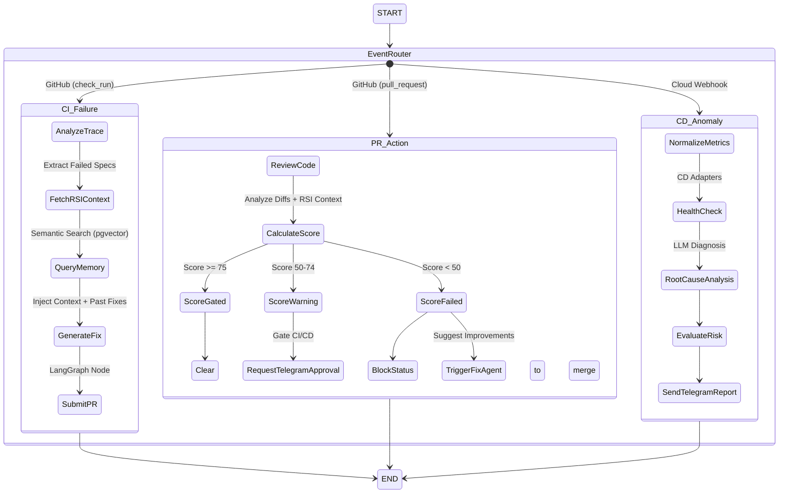

# DevOps Agent - Team BROKENCODE

DevOps Agent is an autonomous CI/CD pipeline monitor, PR reviewer, and issue fixer powered by LangChain and LangGraph. Built for modern DevOps workflows, it seamlessly integrates with GitHub to automatically analyze CI failures, review Pull Requests based on a custom scoring system, and monitor CD pipelines across multiple cloud providers (AWS, GCP, Azure).

## Features

- **Autonomous CI Fixer**: Automatically detects CI workflow failures via GitHub webhooks, triggers an AI agent to trace the root cause using the Repository Structure Index (RSI) and PR diffs, and generates a fix Pull Request autonomously.
- **Intelligent PR Reviews**: Three-tier quality gate for Pull Requests:
  - **Score ≥ 75**: Clear to merge, clean code.
  - **Score 50–74**: Triggers manual Telegram approval before merging.
  - **Score < 50**: Blocks CI/CD and triggers an automated fix agent to suggest improvements based on review findings.
- **CD Pipeline Monitoring**: Monitors deployment pipelines across AWS, GCP, Azure, and custom providers. It aggregates metrics (Deployment Health, Error Rate, Latency) and automates anomaly detection and sends report directly to telegram bot.
- **RSI (Repository Structure Index)**: An intelligent codebase ingestion pipeline that maps the structure of a repository, enabling the AI to precisely fetch code context dynamically.
- **Telegram Moderation**: Deep integration with Telegram for real-time pipeline notifications, PR review summaries, and fast manual approvals via interactive buttons.
- **Multi-Tenant OAuth**: Secure, per-user GitHub OAuth token integration for handling GitHub MCP operations and repository webhooks in isolation.

## Architecture


## Technology Stack

**Backend:**
- Python 3.13+, FastAPI, Uvicorn
- LangChain, LangGraph, Model Context Protocol (MCP)
- PostgreSQL (asyncpg) for RSI storage and event history
- SSE (Server-Sent Events) for real-time frontend logs

**Frontend:**
- React 19, TypeScript, Vite
- Tailwind CSS 4
- React Router

## Setup & Installation

### Prerequisites
- Python 3.13+
- Node.js 20+
- PostgreSQL instance running
- GitHub App with Webhook access configured
- Telegram Bot Token

### Backend Setup

1. **Navigate to the server directory**:
   ```bash
   cd server
   ```
2. **Install dependencies** (assuming a virtual environment):
   ```bash
   uv sync
   ```
3. **Configuration**:
   Ensure you have configured environment variables (GitHub tokens, OpenAI/LLM keys, Database URL, Telegram tokens).
4. **Run the API server**:
   ```bash
   uvicorn main:app --reload --port 8000
   ```

### Frontend Setup

1. **Navigate to the client directory**:
   ```bash
   cd client
   ```
2. **Install dependencies**:
   ```bash
   npm install
   ```
3. **Run the dev server**:
   ```bash
   npm run dev
   ```

### Agent Workflow Dynamics

Our agent orchestrates multiple distinct operational flows simultaneously based on real-time triggers.



## 🧠 Agent Episodic Memory

Rather than solving the same errors from scratch, the platform utilizes a pgvector-powered episodic memory system to "remember" successful past fixes.

- **Continuous Learning:** When an agent successfully merges a fix for a CI failure, the original error trace, root cause, and the files changed are embedded into an `agent_memory` schema utilizing a `vector(1024)` HNSW index (via Cosine similarity).
- **Dynamic Few-Shot RAG:** When a new CI failure occurs, the LangGraph agent queries this vector database against the new error signature. If a highly similar past scenario is found, it dynamically injects the previous successful methodology directly into its reasoning prompt, dramatically reducing resolution time and token usage.

## Preventing Vendor Lock-in (CD Monitoring)

A major feature of this project is its robust abstraction layer for Continuous Deployment (CD) failures, completely decoupling the platform from any single cloud provider's proprietary webhook or logging ecosystem.

- **Unified Interface:** We use an adapter pattern (`cd_providers.get_cd_adapter()`) that dynamically parses failures based on the exact deployment target.
- **Normalized Context:** Whether the failure comes from AWS (CloudWatch/CodeDeploy), GCP (Cloud Logging), Azure (Monitor), or a custom internal webhook, it undergoes normalization into a standardized `CDFailureContext`. 
- **LLM Agnostic Diagnosis:** Because the AI agent only interfaces with the abstracted `CDFailureContext` to diagnose errors and generate root cause report, teams can migrate across cloud providers without changing their root-cause analysis pipelines.

## RSI (Repository Structure Index) Schema

To feed the LangGraph agent with precise codebase context without blowing up the LLM token limit, our RSI system maps the entire codebase into a vector-backed PostgreSQL schema:

- `rsi_file_map`: Stores file paths, role tags (`source`, `config`), line counts, and short AI-generated descriptions for every codebase file.
- `rsi_symbol_map`: Tracks the exact line boundaries of defined classes and functions to allow targeted, high-precision code retrieval.
- `rsi_imports`: Acts as a dependency graph index. Traces module connections backward and forward to assess the blast radius of proposed code changes.
- `rsi_repo_summary`: A high-level cache holding the tech stack footprint, global entry points, and project description, functioning as a lightweight `CLAUDE.md`.
- `agent_memory`: Stores the HNSW vector embeddings of past successful CI fixes for episodic memory retrieval.
---
