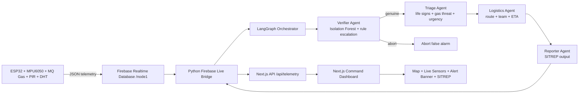
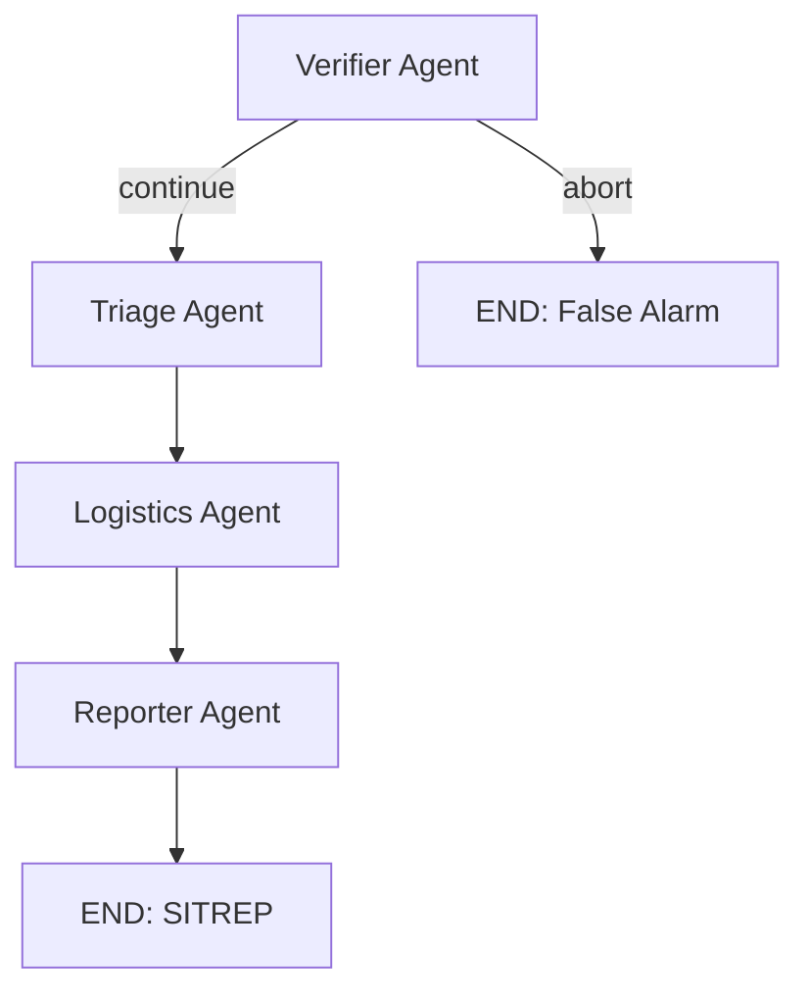

<div align="center">
  
  
  
  

  <h1>NeuroMesh</h1>
  <p><b>Real-Time, Multi-Agent Disaster Intelligence from IoT Sensor Mesh Networks</b></p>

  
  
  
  
</div>

---

## 1) Project Motive

During earthquakes, structural collapses, and hazardous gas leaks, command centers face three hard problems:

- Too much noisy telemetry and false positives
- Delayed decision-making in the golden rescue window
- Poorly contextualized alerts without actionable rescue guidance

NeuroMesh is built to solve this by combining:

- Live IoT ingestion from a sensor node stream
- Multi-model ML inference for seismic, gas, and survivor intelligence
- A verification layer to reduce false alarms
- A multi-agent orchestration pipeline that generates an operational SITREP
- A real-time command dashboard for field-ready visibility

---

## 2) Full Infrastructure View



### Runtime Data Paths

- Path A: IoT telemetry to Firebase to bridge to dashboard for live visualization
- Path B: IoT telemetry to bridge to ML pipeline to agent orchestration to SITREP
- Path C: SITREP and threat level looped back to dashboard for operational action

---

## 3) Why Multi-Model ML Is Required

A single model cannot reliably capture all disaster dimensions. NeuroMesh separates concerns:

- Seismic model: distinguishes normal vibration vs truck vs collapse vs earthquake patterns
- Gas model: classifies safe air vs LPG leak vs smoke-fire signatures
- Survivor model: estimates survivor presence likelihood from PIR and event context
- Validator model: checks whether the event profile is genuinely crisis-like or suspicious noise

This specialization improves interpretability and makes each stage auditable for responders.

---

## 4) ML Models and Artifacts

| Model | Purpose | Algorithm | Input Shape | Output | Artifact |
|---|---|---|---|---|---|
| Seismic | Vibration event classification | 1D CNN (TensorFlow/Keras) | 50 timesteps x 3 axes (150 features) | 4 classes (normal, truck, collapse, earthquake) | `models/seismic_model.keras` |
| Gas | Hazardous gas state classification | RandomForestClassifier | 30 gas readings + seismic flag | class label | `models/gas_model.pkl` |
| Survivor | Survivor presence estimation | LogisticRegression + StandardScaler | pir_count, time_since_event_mins, magnitude | binary presence | `models/survivor_model.pkl`, `models/survivor_scaler.pkl` |
| Validator | Crisis authenticity verification | IsolationForest | seismic_magnitude, gas_ppm, pir_count, event_duration_ms | genuine vs suspicious | `models/validator_model.pkl` |

---

## 5) Dataset Coverage and Rationale

All datasets are generated to encode realistic behavior patterns and edge conditions.

| Dataset | Generated By | Samples | Core Columns | Labels |
|---|---|---:|---|---|
| Seismic | `data/generate_seismic_data.py` | 1100 | 150 waveform features (`f0...f149`) | 0 normal, 1 truck, 2 collapse, 3 earthquake |
| Gas | `data/generate_gas_data.py` | 800 | `ppm_0...ppm_29`, `seismic_flag` | 0 safe, 1 LPG, 2 smoke |
| Survivor | `data/generate_survivor_data.py` | 800 | `pir_count`, `time_since_event_mins`, `magnitude` | `survivor_present` (0/1) |
| Validator (synthetic crisis profile) | `train/train_validator.py` | 400 | seismic_mag, gas_ppm, pir_count, event_duration | anomaly profile training |

### Why these dataset designs matter

- Temporal signals are encoded directly for both seismic and gas behavior
- Cross-sensor context is preserved (gas with seismic flag, PIR with magnitude/time)
- Rare but critical disaster signatures are intentionally represented

---

## 6) Agent Pipeline (Operational Intelligence)

NeuroMesh uses LangGraph with conditional routing:



### Agent responsibilities

- Verifier Agent
  - Isolation Forest score + rule-based escalation
  - Spatial/magnitude correlation checks
  - Decides continue vs abort

- Triage Agent
  - Life signs, gas threat, urgency, survivability

- Logistics Agent
  - Team sizing, route recommendation, response ETA

- Reporter Agent
  - Produces final command-ready SITREP

---

## 7) Firmware Threshold Contract (Matched End-to-End)

The backend and dashboard are aligned to the IoT firmware decision thresholds:

- Acceleration trigger: `abs(acceleration - 1.0) > 0.25`
- Gas trigger: `gas > 2000`
- Earthquake persistence window: `10 seconds`

The Firebase bridge forwards both raw sensor values and firmware-semantic fields:

- `sensor_alert`
- `sensor_sub_alert`
- `earthquake_active`
- `event_duration_ms`
- `sensor_timestamp`

This ensures the dashboard reflects what devices actually decided, not only recomputed UI heuristics.

---

## 8) Dashboard Experience

The dashboard provides:

- Live sensor values (acceleration, gas, PIR, temperature, humidity)
- Geospatial map with event-route visualization
- High-visibility emergency banner for earthquake-triggered incidents
- Final highlighted SITREP block with threat context
- Pipeline state progression (verifier, triage, logistics, dispatch)

---

## 9) Repository Layout

```text
NeuroMesh/
├── agents/                    # Verifier, Triage, Logistics, Reporter
├── dashboard/                 # Next.js command dashboard + API routes
│   ├── src/app/api/telemetry  # live telemetry ingestion endpoint
│   └── src/components/        # map, panels, status widgets
├── data/                      # synthetic dataset generation + CSVs
├── models/                    # trained model artifacts
├── pipeline/                  # LangGraph orchestration + Firebase bridge
├── predict/                   # model inference scripts
├── train/                     # model training scripts
└── tests/                     # pipeline and validation tests
```

---

## 10) Quick Start

### Prerequisites

- Python 3.10+
- Node.js 18+
- npm
- Firebase RTDB access

### A) Frontend

```bash
cd dashboard
npm install
npm run dev
```

Dashboard runs at: `http://localhost:3000`

### B) Python environment

```bash
cd ..
python3 -m venv .venv
source .venv/bin/activate
pip install -U pip
pip install numpy pandas scikit-learn tensorflow langgraph joblib
```

### C) Train models (optional if artifacts already exist)

```bash
python train/train_seismic.py
python train/train_gas.py
python train/train_survivor.py
python train/train_validator.py
```

### D) Run Firebase live bridge

```bash
source .venv/bin/activate
python -m pipeline.firebase_live_bridge \
  --database-url https://hack2future-79802-default-rtdb.firebaseio.com \
  --firebase-path node1 \
  --dashboard-url http://localhost:3000
```

---

## 11) API Contract (Dashboard Telemetry)

### POST `/api/telemetry`

Required:

- `node_id`, `lat`, `lng`, `acceleration_g`, `gas_raw`, `motion`

Optional operational fields:

- `temp_c`, `humidity`, `timestamp`
- `aiSitrep`, `aiThreatLevel`
- `sensor_alert`, `sensor_sub_alert`, `earthquake_active`, `event_duration_ms`, `sensor_timestamp`

### GET `/api/telemetry`

Returns:

- latest reading
- active alerts
- ingest status (`LIVE` or `STALE`)
- active node count

---

## 12) Realism and Accuracy Notes

What improves alignment with physical microscale earthquake simulation:

- Preserve firmware thresholds across all layers (device, bridge, dashboard)
- Preserve event persistence (`earthquake_active`, duration) from sensor semantics
- Use both model output and deterministic safety rules for escalation
- Keep gas calibration realistic (sensor warming, baseline drift, local ventilation effects)

If your local environment has high baseline drift, retrain with additional baseline windows in `data/` generators and retrain corresponding models.

---

## 13) Team-Facing Value

NeuroMesh is not just an alert screen. It is a complete command intelligence stack:

- Sensor truth ingestion
- ML + statistical verification
- Agentic interpretation
- Actionable tactical output
- Human-visible control interface

This creates a usable bridge between raw disaster telemetry and real-world rescue decisions.

---

<div align="center">
  <sub>Built for real-time disaster intelligence and faster life-saving response.</sub>
</div>
